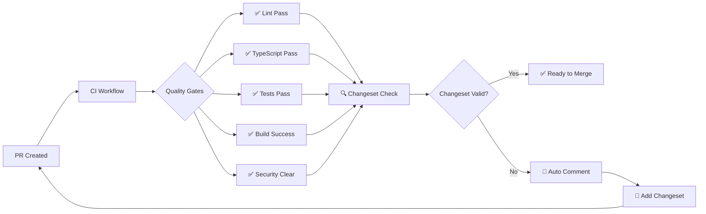
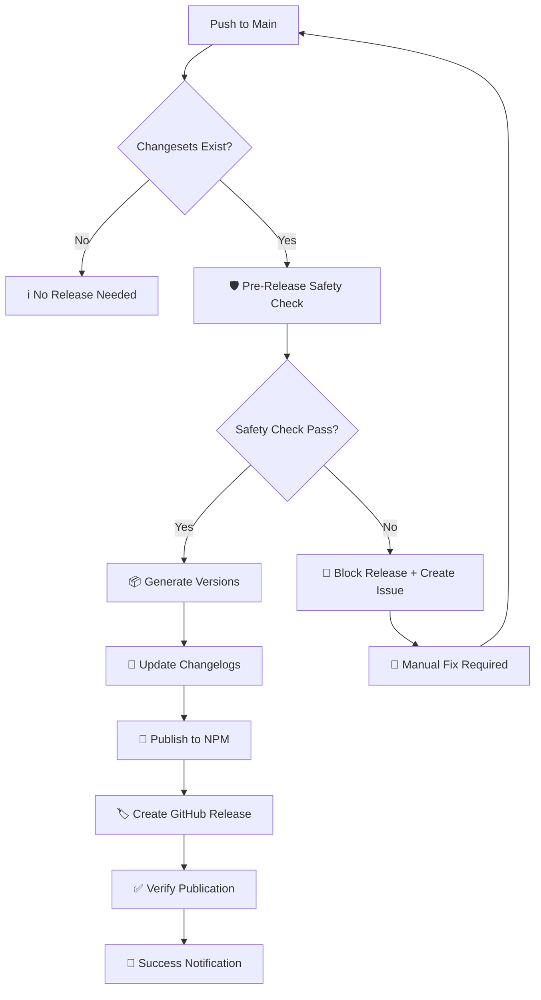

# 🚀 GitHub Automation & CI/CD Guide

Complete GitHub Actions setup for enterprise-grade automation, quality gates, and release management.

---

## 📋 **Overview**

Your repository now has comprehensive GitHub automation including:

- ✅ Continuous Integration (CI)
- ✅ Automated Releases
- ✅ Security Monitoring
- ✅ Dependency Management
- ✅ Issue & PR Templates
- ✅ Quality Gates & Safety Checks

---

## 🔄 **GitHub Actions Workflows**

### **1. 🔍 Continuous Integration (`.github/workflows/ci.yml`)**

**Triggers:** Push to main/master, Pull Requests

**Jobs:**

- **🛡️ Quality Gates** - Lint, TypeScript, Tests, Coverage
- **🏗️ Build & Bundle Analysis** - Build packages, bundle size checks
- **🔐 Security Audit** - Dependency vulnerabilities, Snyk scanning
- **📝 Changeset Validation** - Validates changeset quality on PRs
- **🎯 Compatibility Testing** - Tests on Node.js 18, 20, 21

**Key Features:**

```yaml
# Parallel execution for speed
# Automatic PR comments for missing changesets
# Bundle size monitoring with PR reports
# Security vulnerability scanning
# Cross-platform Node.js compatibility
```

### **2. 🚀 Release & Publish (`.github/workflows/release.yml`)**

**Triggers:** Push to main/master (when changesets exist)

**Jobs:**

- **🛡️ Pre-Release Safety Check** - Comprehensive validation
- **🚀 Release to NPM** - Automated publishing with safety checks
- **📊 Post-Release Monitoring** - Verification and success notifications
- **🚨 Failure Notification** - Auto-creates issues for failed releases

**Safety Features:**

```yaml
# Pre-release validation with your custom scripts
# Automatic version generation and changelog
# NPM publication with verification
# GitHub releases with formatted descriptions
# Failure recovery procedures
```

### **3. 🔄 Dependency Updates (`.github/workflows/dependency-update.yml`)**

**Triggers:** Weekly schedule (Mondays 9 AM UTC), Manual dispatch

**Jobs:**

- **🔍 Check for Updates** - Scans for outdated packages
- **🔄 Update Dependencies** - Smart updates (patch/minor/major)
- **🔐 Security Audit** - Vulnerability detection with auto-issue creation

**Automation Features:**

```yaml
# Automatic PR creation for dependency updates
# Configurable update types (patch/minor/major)
# Quality checks after updates
# Security vulnerability monitoring
# Detailed update reports
```

---

## 📋 **Issue & PR Templates**

### **🐛 Bug Report Template (`.github/ISSUE_TEMPLATE/bug_report.yml`)**

**Comprehensive Form Fields:**

- ✅ Prerequisites checklist
- ✅ Detailed bug description
- ✅ Reproduction steps
- ✅ Expected vs actual behavior
- ✅ Code samples and error logs
- ✅ Environment details (versions, OS, browser)
- ✅ Configuration examples
- ✅ Contribution willingness

### **✨ Feature Request Template (`.github/ISSUE_TEMPLATE/feature_request.yml`)**

**Structured Request Form:**

- ✅ Problem statement
- ✅ Proposed solution
- ✅ Alternatives considered
- ✅ Code examples
- ✅ Priority assessment
- ✅ Complexity estimation
- ✅ Implementation willingness

### **📝 Pull Request Template (`.github/pull_request_template.md`)**

**Complete PR Checklist:**

- ✅ Change type classification
- ✅ Testing requirements
- ✅ Documentation updates
- ✅ Security considerations
- ✅ Bundle impact assessment
- ✅ Deployment requirements
- ✅ Pre-release checklist
- ✅ Changeset information
- ✅ Reviewer guidelines

---

## 🔐 **Required Secrets**

### **Essential Secrets for Automation:**

```bash
# NPM Publishing
NPM_TOKEN=your_npm_token_here

# Security Scanning (Optional)
SNYK_TOKEN=your_snyk_token_here

# Code Coverage (Optional)
CODECOV_TOKEN=your_codecov_token_here
```

### **🔧 Setting Up Secrets:**

1. **NPM Token:**

   ```bash
   # Generate NPM token
   npm login
   npm token create --read-write
   
   # Add to GitHub Secrets:
   # Settings → Secrets → Actions → New repository secret
   # Name: NPM_TOKEN
   # Value: npm_xxx...
   ```

2. **Snyk Token (Optional):**

   ```bash
   # Sign up at snyk.io
   # Get API token from Account Settings
   # Add as SNYK_TOKEN secret
   ```

3. **Codecov Token (Optional):**

   ```bash
   # Sign up at codecov.io
   # Link your repository
   # Get token and add as CODECOV_TOKEN secret
   ```

---

## 🎯 **Quality Gates & Safety Checks**

### **🛡️ Automated Quality Gates:**



### **🚨 Blocking Conditions:**

- ❌ **Lint errors** (warnings OK)
- ❌ **TypeScript compilation errors**
- ❌ **Test failures**
- ❌ **Build failures**
- ❌ **High/Critical security vulnerabilities**
- ❌ **Missing changeset** (for feature/fix PRs)

---

## 🚀 **Release Automation Flow**

### **📦 Automated Release Process:**



### **🔄 Release Commands Integration:**

Your new GitHub Actions integrate with your local safety commands:

```bash
# Local development (uses same validation)
pnpm pre-release          # Same checks as GitHub Actions
pnpm validate-changesets  # Same validation as CI
pnpm release:safe         # Mirrors automated release flow
```

---

## 📊 **Monitoring & Notifications**

### **🔔 Automatic Notifications:**

1. **✅ Successful Releases:**
   - Commit comments with release details
   - Package publication verification
   - Download statistics

2. **❌ Failed Releases:**
   - Auto-created GitHub issues
   - Detailed failure reports
   - Recovery instructions

3. **🔐 Security Alerts:**
   - Vulnerability detection issues
   - Automatic dependency update PRs
   - Security audit reports

4. **📦 Dependency Updates:**
   - Weekly automated PRs
   - Update impact analysis
   - Quality verification

### **📈 Metrics & Reports:**

```bash
# Bundle size monitoring
# Test coverage tracking  
# Security vulnerability trends
# Release frequency analysis
# Dependency update success rate
```

---

## 🎛️ **Workflow Configuration**

### **⚙️ Customizing Automation:**

#### **CI Workflow Adjustments:**

```yaml
# .github/workflows/ci.yml

# Adjust Node.js versions
strategy:
  matrix:
    node: ['18', '20', '21']  # Modify as needed

# Change security severity
args: --severity-threshold=medium  # low, medium, high

# Bundle size limits
CLIENT_SIZE_LIMIT: 10240  # 10KB (adjust as needed)
```

#### **Release Workflow Tuning:**

```yaml
# .github/workflows/release.yml

# Release environment
environment:
  name: production  # Change to staging for testing

# Pre-release timeout
timeout-minutes: 15  # Adjust for complex builds
```

#### **Dependency Update Schedule:**

```yaml
# .github/workflows/dependency-update.yml

# Change schedule
- cron: '0 9 * * 1'  # Weekly Monday 9 AM UTC
# Options: daily, weekly, monthly
```

---

## 🔧 **Local Development Integration**

### **🔄 Matching Local & CI Environments:**

Your local scripts match GitHub Actions exactly:

```bash
# Local commands that mirror CI
pnpm lint              # Same as CI lint job
pnpm type-check        # Same as CI TypeScript job  
pnpm test --coverage   # Same as CI test job
pnpm build             # Same as CI build job
pnpm pre-release       # Same as release safety check
```

### **🧪 Testing GitHub Actions Locally:**

```bash
# Use act to test workflows locally
npm install -g @nektos/act

# Test CI workflow
act pull_request

# Test release workflow (dry run)
act push -j pre-release-check
```

---

## 🎯 **Best Practices**

### **✅ Recommended Workflow:**

1. **🔄 Development Cycle:**

   ```bash
   git checkout -b feature/new-feature
   # Make changes
   pnpm pre-release              # Local safety check
   pnpm changeset               # Create changeset
   git commit && git push
   # Open PR → CI runs automatically
   ```

2. **🚀 Release Process:**

   ```bash
   # Merge PR → Release workflow triggers
   # Automatic: safety check → publish → verify
   # Monitor: GitHub notifications & issues
   ```

3. **🔐 Security Management:**

   ```bash
   # Weekly: Dependency update PRs created
   # Review → Approve → Merge
   # Security issues: Auto-created → Manual review
   ```

### **⚠️ Troubleshooting:**

#### **Common Issues:**

1. **❌ NPM Publication Fails:**

   ```bash
   # Check NPM_TOKEN secret
   # Verify package.json permissions
   # Review version conflicts
   ```

2. **🔒 Security Workflow Fails:**

   ```bash
   # Add SNYK_TOKEN secret
   # Or disable Snyk steps in CI
   ```

3. **📦 Bundle Size Warnings:**

   ```bash
   # Adjust size limits in CI workflow
   # Review bundle optimization
   ```

---

## 🎉 **Your Complete Automation Stack**

**✅ Enterprise-Ready Features:**

- 🤖 **Fully Automated Releases** - Zero-touch publishing
- 🛡️ **Comprehensive Quality Gates** - Block bad code
- 🔐 **Security Monitoring** - Vulnerability detection
- 📦 **Dependency Management** - Automated updates
- 📋 **Professional Templates** - Structured contributions
- 📊 **Release Monitoring** - Success verification
- 🚨 **Failure Recovery** - Automatic issue creation
- 📱 **Smart Notifications** - Keep you informed

**🚀 Ready for Production!**

Your NPM packages now have enterprise-grade automation that:

- Prevents human errors
- Ensures consistent quality
- Automates routine tasks
- Monitors security
- Facilitates contributions
- Provides detailed reporting

**Deploy with confidence! 🎯**

# GitHub Automation Guide

## 🚀 Complete GitHub Integration for next-s3-uploader

This guide covers the comprehensive GitHub automation setup for the next-s3-uploader monorepo, including CI/CD, security, and community management.

## 📁 Repository Structure

```
.github/
├── workflows/
│   ├── ci.yml                    # Continuous Integration
│   ├── release.yml               # Automated Releases
│   └── dependency-update.yml     # Dependency Management
├── ISSUE_TEMPLATE/
│   ├── bug_report.yml           # Bug Report Template  
│   ├── feature_request.yml      # Feature Request Template
│   └── blank.md                 # Blank Issue Template
├── CODEOWNERS                   # Code Review Assignments
├── FUNDING.yml                  # Sponsorship Configuration
├── dependabot.yml              # Automated Dependency Updates
├── pull_request_template.md    # PR Template
└── SECURITY.md                 # Security Policy
```

## 🔄 Workflows Overview

### 1. Continuous Integration (`ci.yml`)

**Triggers:**

- Push to any branch
- Pull requests to `main`
- Manual workflow dispatch

**Jobs:**

- **Lint & Type Check**: ESLint, TypeScript validation
- **Test**: Unit tests with Vitest across Node 18/20
- **Build**: Package building and validation
- **Health Check**: Comprehensive package health validation

**Features:**

- Matrix strategy for Node.js versions
- Dependency caching for faster builds
- Parallel job execution
- Build artifact validation

### 2. Release Automation (`release.yml`)

**Triggers:**

- Push to `main` branch (with changesets)
- Manual workflow dispatch for snapshot releases

**Jobs:**

- **Release**: Full production release with changesets
- **Snapshot**: Pre-release snapshots for testing

**Features:**

- Automated version bumping
- Changelog generation
- NPM publishing with authentication
- Git tag creation
- GitHub release creation

### 3. Dependency Management (`dependency-update.yml`)

**Triggers:**

- Weekly schedule (Sundays at 09:00 UTC)
- Manual workflow dispatch

**Jobs:**

- **Health Check**: Pre-update validation
- **Update Dependencies**: Smart dependency updates
- **Validate**: Post-update testing
- **Create PR**: Automated pull request creation

**Features:**

- Dependency health validation
- Automated testing after updates
- Conventional commit messages
- Smart PR creation with detailed information

## 🤖 Dependabot Configuration

Automated dependency updates across the monorepo:

### Schedules

- **Monday**: Main package, CLI, workspace dependencies
- **Tuesday**: Documentation, GitHub Actions

### Configuration

- Weekly update intervals
- Staggered timing to prevent conflicts
- Commit message prefixes for conventional commits
- Automatic reviewer assignment
- Proper labeling for organization

### Packages Monitored

- `/packages/next-s3-uploader` - Core package
- `/packages/cli` - CLI tool
- `/` - Workspace root
- `/apps/docs` - Documentation
- GitHub Actions dependencies

## 👥 Community Templates

### Issue Templates

1. **Bug Report** (`bug_report.yml`)
   - Environment details
   - Reproduction steps
   - Expected vs actual behavior
   - Code samples
   - System information

2. **Feature Request** (`feature_request.yml`)
   - Feature description
   - Use case explanation
   - Implementation suggestions
   - Alternative solutions

### Pull Request Template

- Description and motivation
- Type of change checklist
- Testing verification
- Documentation updates
- Breaking change notifications

## 🔒 Security & Governance

### CODEOWNERS

- Repository-wide protection: `@abhay`
- Core package: `@abhay`
- Release files: `@abhay`
- Security files: `@abhay`
- Documentation: Community reviewable

### Security Policy (`SECURITY.md`)

- Supported versions table
- Private vulnerability reporting
- Response timelines
- Security best practices
- Contact information

### Funding Configuration

- GitHub Sponsors integration
- Multiple funding platform support
- Community contribution encouragement

## 🚀 Getting Started

### 1. Repository Setup

```bash
# Ensure all workflows are enabled
gh workflow list

# Enable required permissions
gh auth refresh -s write:packages,write:actions
```

### 2. Secrets Configuration

Set up the following repository secrets:

```bash
# NPM Publishing
NPM_TOKEN=<your-npm-token>

# GitHub Actions (usually auto-configured)
GITHUB_TOKEN=<auto-generated>
```

### 3. Branch Protection

Enable branch protection for `main`:

- Require PR reviews
- Require status checks
- Restrict pushes to main
- Require up-to-date branches

## 📊 Monitoring & Maintenance

### Daily Operations

- Monitor workflow runs in Actions tab
- Review Dependabot PRs
- Respond to community issues/PRs

### Weekly Tasks

- Review security advisories
- Check dependency health
- Monitor package download metrics
- Review and merge dependency updates

### Monthly Tasks

- Update documentation
- Review and update issue templates
- Security policy updates
- Community engagement metrics

## 🔧 Customization

### Workflow Customization

1. **Add New Checks**:

   ```yaml
   # Add to ci.yml
   - name: Custom Check
     run: npm run custom-check
   ```

2. **Modify Release Process**:

   ```yaml
   # Customize release.yml
   - name: Custom Release Step
     run: npm run custom-release
   ```

3. **Extended Testing**:

   ```yaml
   # Add new test matrix
   strategy:
     matrix:
       node-version: [18, 20, 22]
       os: [ubuntu-latest, windows-latest, macos-latest]
   ```

### Template Customization

1. **Issue Templates**: Modify `.github/ISSUE_TEMPLATE/`
2. **PR Template**: Edit `.github/pull_request_template.md`
3. **Security Policy**: Update `.github/SECURITY.md`

## 🏆 Best Practices

### Commit Messages

Follow conventional commits:

```
feat(core): add new upload method
fix(cli): resolve configuration issue  
docs(readme): update installation guide
chore(deps): update dependencies
```

### Release Process

1. Create changesets: `pnpm changeset`
2. Version packages: `pnpm changeset version`
3. Push to main: Automatic release
4. Monitor release workflow

### Security

- Regular dependency audits
- Monitor security advisories
- Keep workflows updated
- Review and update permissions

## 📈 Metrics & Analytics

### GitHub Insights

- Community metrics
- Contributor statistics
- Issue/PR trends
- Release download metrics

### NPM Analytics

- Package download statistics
- Version adoption rates
- Geographic distribution

## 🆘 Troubleshooting

### Common Issues

1. **Workflow Failures**
   - Check runner availability
   - Verify secrets configuration
   - Review dependency conflicts

2. **Release Issues**
   - Verify NPM token validity
   - Check changesets configuration
   - Confirm branch protection settings

3. **Dependabot Issues**
   - Review dependency conflicts
   - Check update schedules
   - Verify PR creation settings

### Debug Commands

```bash
# Check workflow status
gh workflow list

# View workflow runs
gh run list

# Debug specific workflow
gh run view [run-id] --log

# Check repository settings
gh repo view --json defaultBranch,hasIssuesEnabled
```

## 📝 Additional Resources

- [GitHub Actions Documentation](https://docs.github.com/en/actions)
- [Changesets Documentation](https://github.com/changesets/changesets)
- [Dependabot Configuration](https://docs.github.com/en/code-security/dependabot)
- [NPM Publishing Guide](https://docs.npmjs.com/packages-and-modules/contributing-packages-to-the-registry)

---

*This automation setup provides enterprise-grade CI/CD, security, and community management for the next-s3-uploader project.*
