# 🚀 Complete Release Lifecycle Guide

## 📋 **Overview**

This guide covers the complete lifecycle for releasing your `next-s3-uploader` packages, from development to NPM publication with automated changelog generation and quality gates.

---

## 🔄 **Release Lifecycle Flowchart**

The complete release process from development to NPM publication:

```mermaid
flowchart TD
    A["🚀 Start Development"] --> B["📝 Make Code Changes"]
    B --> C["✅ Run Health Check<br/>pnpm maintenance:health"]
    C --> D{Health Check<br/>Passes?}
    D -->|❌ No| E["🔧 Fix Issues<br/>- Fix tests<br/>- Fix linting<br/>- Fix build"]
    E --> C
    D -->|✅ Yes| F["📋 Create Changeset<br/>pnpm changeset"]
    F --> G["📊 Preview Release<br/>pnpm changeset:status"]
    G --> H{Ready to<br/>Release?}
    H -->|❌ No| I["⏳ Continue Development<br/>More changes needed"]
    I --> B
    H -->|✅ Yes| J["🏗️ Generate Versions<br/>pnpm version-packages"]
    J --> K["📝 Review Generated<br/>- CHANGELOG.md<br/>- package.json versions"]
    K --> L{Changes Look<br/>Good?}
    L -->|❌ No| M["✏️ Edit Changeset<br/>Improve descriptions"]
    M --> J
    L -->|✅ Yes| N["📤 Publish to NPM<br/>pnpm release"]
    N --> O["🎉 Release Complete!<br/>Both packages published"]
    O --> P["📈 Monitor<br/>- Download stats<br/>- User feedback<br/>- Issues"]
    P --> Q{Need Another<br/>Release?}
    Q -->|✅ Yes| B
    Q -->|❌ No| R["✅ Maintenance Mode<br/>Monitor & Support"]
```



---

## 🦋 **Changeset Workflow Detail**

How changesets work for your linked packages:

```mermaid
flowchart LR
    A["📝 pnpm changeset"] --> B{Select Packages}
    B --> C["📦 next-s3-uploader"]
    B --> D["🛠️ create-next-s3-uploader"]
    C --> E["🔗 Linked Packages<br/>Both Selected"]
    D --> E
    E --> F{Choose Type}
    F --> G["🐛 patch<br/>Bug fixes<br/>0.3.0 → 0.3.1"]
    F --> H["✨ minor<br/>New features<br/>0.3.0 → 0.4.0"]
    F --> I["💥 major<br/>Breaking changes<br/>0.3.0 → 1.0.0"]
    G --> J["✍️ Write Summary<br/>Describe the changes"]
    H --> J
    I --> J
    J --> K["💾 Generate .changeset/*.md"]
    K --> L["✅ Changeset Created<br/>Ready for next steps"]
```



---

## 📊 **Version Generation Process**

What happens when you run `pnpm version-packages`:

```mermaid
flowchart TD
    A["📋 pnpm version-packages"] --> B["🔍 Scan Changesets<br/>.changeset/*.md"]
    B --> C["📦 Calculate New Versions<br/>Based on changeset types"]
    C --> D["📝 Update package.json<br/>next-s3-uploader: 0.3.0 → 0.4.0<br/>create-next-s3-uploader: 0.3.0 → 0.4.0"]
    D --> E["📰 Generate CHANGELOG.md<br/>- Formatted entries<br/>- GitHub PR/commit links<br/>- Professional formatting"]
    E --> F["🗑️ Consume Changesets<br/>Delete .changeset/*.md files"]
    F --> G["✅ Ready for Publication<br/>All files updated"]
    
    style A fill:#e1f5fe
    style G fill:#e8f5e8
```



---

## 🛡️ **Quality Gates & Health Checks**

Your comprehensive health check covers all aspects:

```mermaid
flowchart LR
    A["🩺 pnpm maintenance:health"] --> B["📦 Dependencies<br/>✅ Production deps secure<br/>⚠️ Check for updates"]
    A --> C["🔷 TypeScript<br/>✅ Strict compilation<br/>❌ Zero errors"]
    A --> D["🔍 ESLint<br/>✅ Zero errors<br/>⚠️ Warnings OK"]
    A --> E["🧪 Tests<br/>✅ All passing<br/>📊 Coverage good"]
    A --> F["🏗️ Build<br/>✅ CJS + ESM + DTS<br/>⚡ Fast builds"]
    A --> G["📊 Bundle Size<br/>✅ Under limits<br/>📏 1.83KB client"]
    A --> H["📁 File Structure<br/>✅ All dist files<br/>🗂️ Proper structure"]
    A --> I["🔐 Security<br/>✅ No vulnerabilities<br/>🛡️ Trusted deps"]
    
    B --> J["✅ Health Check Complete"]
    C --> J
    D --> J
    E --> J
    F --> J
    G --> J
    H --> J
    I --> J
    
    style A fill:#e3f2fd
    style J fill:#e8f5e8
```



---

## 📤 **Publishing Process**

What happens during `pnpm release`:

```mermaid
flowchart TD
    A["📤 pnpm release"] --> B["🏗️ Build Packages<br/>turbo build --filter=example^..."]
    B --> C["📋 Final Validation<br/>- Check versions<br/>- Verify changelogs<br/>- Confirm build artifacts"]
    C --> D["📦 Publish next-s3-uploader<br/>npm publish (0.4.0)"]
    D --> E["🛠️ Publish create-next-s3-uploader<br/>npm publish (0.4.0)"]
    E --> F["🏷️ Git Tagging<br/>Create release tags"]
    F --> G["📱 GitHub Release<br/>Create GitHub release<br/>with generated changelog"]
    G --> H["📊 Post-Release<br/>- Monitor downloads<br/>- Check for issues<br/>- Update documentation"]
    H --> I["🎉 Release Complete!<br/>Both packages live on NPM"]
    
    style A fill:#e3f2fd
    style I fill:#e8f5e8
```



---

## 📋 **Step-by-Step Instructions**

### **🚀 Complete Release Workflow**

#### **1. Health Check First**

```bash
cd packages/next-s3-uploader
pnpm maintenance:health
```

**Expected:** ✅ All checks pass (warnings OK)

#### **2. Create Changeset**

```bash
cd /Users/abhay/Desktop/Code/next-s3-uploader
pnpm changeset
```

**Process:**

- Select packages (both will be selected due to linking)
- Choose version type (patch/minor/major)
- Write clear, descriptive summary
- Explain WHY the change was made
- Describe HOW users should adapt (if breaking)

#### **3. Preview Release**

```bash
pnpm changeset:status
# or for detailed view:
pnpm release:check
```

**Verify:**

- Correct version bumps
- Both packages included
- Appropriate semantic versioning

#### **4. Generate Versions**

```bash
pnpm version-packages
```

**What happens:**

- Updates `package.json` versions
- Generates `CHANGELOG.md` with GitHub links
- Consumes changeset files
- Ready for publication

#### **5. Review Changes**

```bash
# Check the generated changelog
cat packages/next-s3-uploader/CHANGELOG.md

# Verify versions
grep "version" packages/*/package.json
```

#### **6. Publish**

```bash
pnpm release
```

**Result:** Both packages published to NPM with matching versions

---

## 🎯 **Release Scenarios**

### **🐛 Patch Release (Bug Fix)**

```bash
# Example: Fix memory leak in upload progress
pnpm changeset
# Select: patch
# Summary: "Fix memory leak in upload progress tracking"

# Result: 0.3.0 → 0.3.1
```

### **✨ Minor Release (New Feature)**

```bash
# Example: Add CloudFront support
pnpm changeset
# Select: minor
# Summary: "Add CloudFront CDN integration support"

# Result: 0.3.0 → 0.4.0
```

### **💥 Major Release (Breaking Change)**

```bash
# Example: Change API structure
pnpm changeset
# Select: major
# Summary: "BREAKING: Simplify upload configuration API

**Breaking Changes:**
- `uploadConfig.build()` now returns simplified object
- Removed deprecated `useS3FileUpload` hook
- Updated TypeScript types for better inference

**Migration Guide:**
- Replace `useS3FileUpload` with `useUploadRoute`
- Update config usage: `config.build()` instead of `initializeUploadConfig(config.build())`

**Why:** Improve developer experience and reduce bundle size"

# Result: 0.3.0 → 1.0.0
```

---

## 🚨 **Emergency Releases**

### **Critical Bug Fix**

```bash
# 1. Fast health check
pnpm maintenance:health

# 2. Create patch changeset
pnpm changeset
# Select: patch
# Summary: "HOTFIX: Fix critical security vulnerability in file validation"

# 3. Skip detailed review, go straight to publish
pnpm version-packages && pnpm release
```

### **Rollback Scenario**

```bash
# If you need to unpublish (within 72 hours)
npm unpublish next-s3-uploader@0.4.0
npm unpublish create-next-s3-uploader@0.4.0

# Then fix and re-release
pnpm changeset  # Create new changeset
pnpm version-packages && pnpm release
```

---

## 🧪 **Testing Releases**

### **Snapshot Release (Beta Testing)**

```bash
pnpm release:snapshot
# Publishes as: 0.3.0-snapshot-20241217
# Good for: Testing with users before official release
```

### **Dry Run (Validation)**

```bash
pnpm release:dry
# Shows what would be published without actually publishing
# Good for: Final validation before real release
```

---

## 🔄 **Release Cadence**

### **Recommended Schedule**


### **Planning Releases**

- **Patches**: As needed for critical issues
- **Minors**: Monthly feature releases
- **Majors**: Quarterly with proper deprecation warnings

---

## 📊 **Post-Release Monitoring**

### **What to Monitor**

```bash
# NPM download stats
npm info next-s3-uploader

# GitHub releases
gh release list

# Bundle size trends
pnpm size-check

# Health status
pnpm maintenance:health
```

### **Success Metrics**

- ✅ Clean release (no failed publishes)
- ✅ Download counts increasing
- ✅ No critical issues reported
- ✅ Documentation accurate
- ✅ Bundle sizes stable

---

## 🎯 **Quick Reference Commands**

### **Daily Development**

```bash
# Health check
pnpm maintenance:health

# Create changeset
pnpm changeset

# Preview release
pnpm changeset:status
```

### **Release Day**

```bash
# Generate versions
pnpm version-packages

# Publish
pnpm release

# Monitor
npm info next-s3-uploader
```

### **Package-Specific Shortcuts**

```bash
cd packages/next-s3-uploader

# All-in-one release
pnpm release:changeset

# Preview only
pnpm release:preview

# Emergency patch (bypass changesets)
pnpm release:patch
```

---

## 🏆 **Best Practices**

### **✅ Do's**

- ✅ Always run health check before creating changesets
- ✅ Write clear, descriptive changeset summaries
- ✅ Preview releases before publishing
- ✅ Test major changes with snapshot releases
- ✅ Monitor downloads and issues after release
- ✅ Use semantic versioning correctly

### **❌ Don'ts**

- ❌ Don't skip health checks
- ❌ Don't publish without reviewing generated changelog
- ❌ Don't use generic changeset messages
- ❌ Don't publish during peak usage hours
- ❌ Don't ignore bundle size increases
- ❌ Don't release major versions without deprecation warnings

---

## 🎉 **Your Release System is Enterprise-Ready!**

You now have:

- ✅ **Automated changelog generation**
- ✅ **Synchronized package versions**
- ✅ **Comprehensive quality gates**
- ✅ **Professional release workflow**
- ✅ **GitHub integration**
- ✅ **Bundle optimization**
- ✅ **Emergency procedures**

**Ready to ship world-class NPM packages! 🚀**

---

## 🛡️ **Mistake Prevention & Safety System**

Human errors are inevitable, but we can build systems to catch them before they cause problems. Here's your comprehensive safety net:

### **🚨 Common Mistakes & Prevention**

```mermaid
flowchart TD
    A["😱 Common Mistakes"] --> B["🔍 Wrong Version Bump<br/>patch vs minor vs major"]
    A --> C["📝 Poor Changeset Description<br/>Generic or unclear"]
    A --> D["⚠️ Skipping Health Checks<br/>Publishing broken code"]
    A --> E["🏷️ Version Mismatch<br/>CLI vs package different"]
    A --> F["📦 Missing Dependencies<br/>Forgot to add new deps"]
    A --> G["🔥 Publishing During Peak Hours<br/>Bad timing for issues"]
    
    B --> H["✅ Prevention Methods"]
    C --> H
    D --> H
    E --> H
    F --> H
    G --> H
    
    H --> I["🤖 Automated Validation<br/>Scripts catch errors"]
    H --> J["📋 Checklists<br/>Step-by-step validation"]
    H --> K["🔒 Pre-publish Hooks<br/>Block bad releases"]
    H --> L["👥 Review Process<br/>Dry runs & previews"]
    
    style A fill:#ffebee
    style H fill:#e8f5e8
```



---

## 🤖 **Automated Safeguards**

Let's add bulletproof validation scripts to catch mistakes before they happen:
