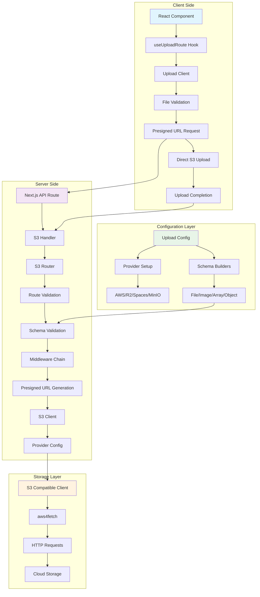
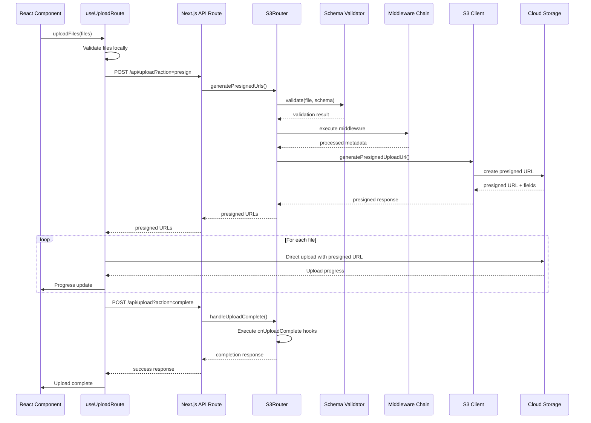
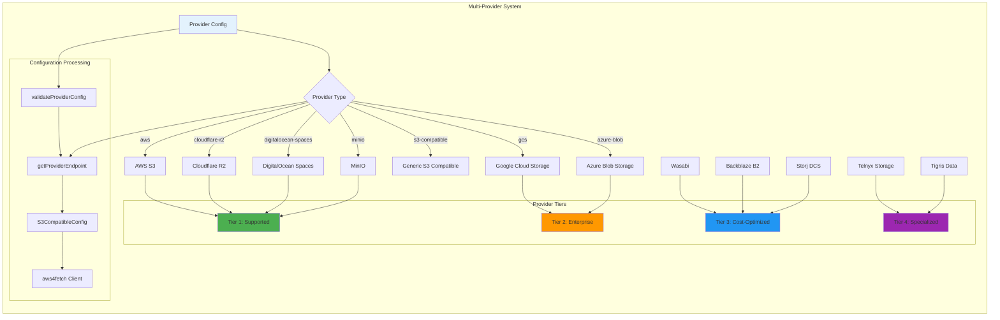
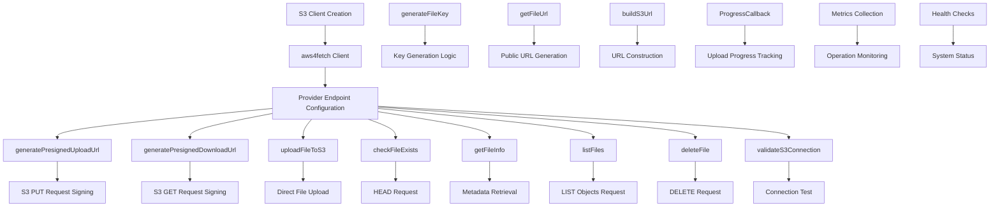

I'll analyze the current pushduck architecture and create comprehensive mermaid diagrams showing how everything works together.





```mermaid
graph TD
    subgraph "Router System Architecture"
        A[s3.createRouter] --> B[S3Router Instance]
        B --> C[Route Definition Map]
        
        subgraph "Route Types"
            D[s3.file] --> E[S3FileSchema]
            F[s3.image] --> G[S3ImageSchema]
            H[s3.array] --> I[S3ArraySchema]
            J[s3.object] --> K[S3ObjectSchema]
        end
        
        subgraph "Route Configuration"
            L[Schema Validation]
            M[Middleware Chain]
            N[Lifecycle Hooks]
            O[Path Configuration]
        end
        
        subgraph "Handler Creation"
            P[createS3Handler] --> Q[GET Handler]   (deprecated)
            P --> R[POST Handler]
            Q --> S[Route Introspection]
            R --> T[Request Processing]
        end
        
        subgraph "Request Flow"
            T --> U{Action Type}
            U -->|presign| V[Generate Presigned URLs]
            U -->|complete| W[Handle Upload Complete]
            V --> X[S3 Client Operations]
            W --> Y[Lifecycle Hook Execution]
        end
    end
    
    C --> L
    C --> M
    C --> N
    C --> O
    E --> L
    G --> L
    I --> L
    K --> L
    
    style A fill:#4caf50
    style B fill:#2196f3
    style P fill:#ff9800
    style T fill:#9c27b0
```




```mermaid
graph TB
    subgraph "Configuration & Initialization Flow"
        A[createUploadConfig] --> B[UploadConfigBuilder]
        B --> C[provider]
        B --> D[defaults]
        B --> E[paths]
        B --> F[security]
        B --> G[hooks]
        
        C --> H[Provider Validation]
        H --> I[S3 Client Creation]
        I --> J[Storage Instance]
        
        subgraph "Auto Configuration"
            K[Environment Detection] --> L[Provider Auto-Config]
            L --> M[Default Settings]
        end
        
        subgraph "Global State"
            N[Global Upload Config] --> O[setGlobalUploadConfig]
            O --> P[getUploadConfig]
            P --> Q[isConfigInitialized]
        end
        
        G --> R[Build Result]
        J --> R
        
        subgraph "Build Result Components"
            R --> S[config: UploadConfig]
            R --> T[storage: StorageInstance]  
            R --> U[s3: Schema Builder]
            R --> V[createS3Handler: Function]  (deprecated)
        end
        
        subgraph "Schema Builder (s3)"
            U --> W[s3.file]
            U --> X[s3.image]
            U --> Y[s3.array]
            U --> Z[s3.object]
            U --> AA[s3.createRouter]
        end
        
        AA --> BB[S3Router Instance]
        BB --> V
        V --> CC[HTTP Handlers]
        
        K --> B
        N --> B
    end
    
    style A fill:#4caf50
    style R fill:#2196f3
    style CC fill:#ff9800
    style U fill:#9c27b0
```



```mermaid
graph LR
    subgraph "Current Next.js-Only Handler"
        A[createS3Handler] --> B[NextRequest/NextResponse]  (deprecated)
        B --> C[Next.js Specific Logic]
        C --> D[GET/POST Handlers]
    end
    
    subgraph "Proposed Framework-Agnostic Architecture"
        E[S3Router] --> F[.handlers Property]
        F --> G[Web Standard Request/Response]
        G --> H[Universal Core Logic]
        
        H --> I[toNextJsHandler]
        H --> J[toExpressHandler]
        H --> K[toHonoHandler]
        H --> L[toFastifyHandler]
        
        I --> M[Next.js Compatible]
        J --> N[Express Compatible]
        K --> O[Hono Compatible]
        L --> P[Fastify Compatible]
    end
    
    subgraph "Migration Path"
        Q[Current Usage] --> R[export const GET POST = createS3Handler]  (deprecated)
        S[New Usage] --> T[export const GET POST = uploadRouter.handlers]
        S --> U[export const GET POST = toNextJsHandler uploadRouter.handlers]
        
        style Q fill:#ffcdd2
        style S fill:#c8e6c9
    end
```

## Pushduck Current Architecture Analysis

Based on my analysis of the pushduck codebase, here's how everything currently works:

## 🏗️ Overall Architecture

The first diagram shows the **complete system architecture** with:

- **Client Side**: React components using `useUploadRoute` hook
- **Server Side**: Next.js API routes with S3 handlers and routers
- **Configuration Layer**: Upload config and provider setup
- **Storage Layer**: S3-compatible client with aws4fetch

## 🔄 Upload Flow Sequence

The second diagram shows the **complete upload sequence**:

1. Client initiates upload through React hook
2. Request goes to Next.js API route for presigned URLs
3. Server validates files and generates presigned URLs
4. Client uploads directly to S3 storage
5. Client notifies server of completion
6. Server executes completion hooks

## 🎯 Router System Architecture

The third diagram shows how the **S3 router system** works:

- Route definitions using schema builders (`s3.file()`, `s3.image()`, etc.)
- Request processing with action-based routing (presign/complete)
- Integration with validation, middleware, and lifecycle hooks

## 🌐 Multi-Provider System

The fourth diagram shows the **provider architecture**:

- Support for 16+ cloud storage providers organized in tiers
- Configuration validation and endpoint generation
- Unified S3-compatible interface using aws4fetch

## ✅ Schema Validation System  

The fifth diagram shows the **validation pipeline**:

- Different schema types (file, image, array, object)
- Builder pattern for configuration
- Comprehensive validation pipeline with transforms and refinements

## ⚙️ Configuration & Initialization

The sixth diagram shows **how configuration works**:

- Upload config builder with provider, defaults, paths, security, hooks
- Auto-configuration and environment detection
- Global state management
- Build result with all necessary components

## 📁 S3 Client & Storage Operations

The seventh diagram shows the **storage layer operations**:

- Core operations (presigned URLs, uploads, file checks)
- Advanced operations (listing, deletion, batch operations)
- Helper functions and progress monitoring

## 🔧 Current vs Proposed Architecture

The final diagram shows the **migration path**:

- **Current**: Tightly coupled to Next.js with `NextRequest`/`NextResponse`
- **Proposed**: Framework-agnostic with Web Standard handlers and adapters
- **Migration**: Clean transition from current API to new universal API

## Key Insights

1. **Next.js Dependency**: Current system is hardcoded for Next.js only
2. **Solid Foundation**: The core logic (schemas, validation, S3 operations) is framework-agnostic
3. **Clear Separation**: Handler creation is the only part that needs framework adapters
4. **Migration Path**: Can maintain backward compatibility while adding new universal API

The architecture is well-designed with clear separation of concerns. The main task for framework-agnostic support is to extract the Next.js-specific handler logic and create universal Web Standard handlers with framework adapters.
